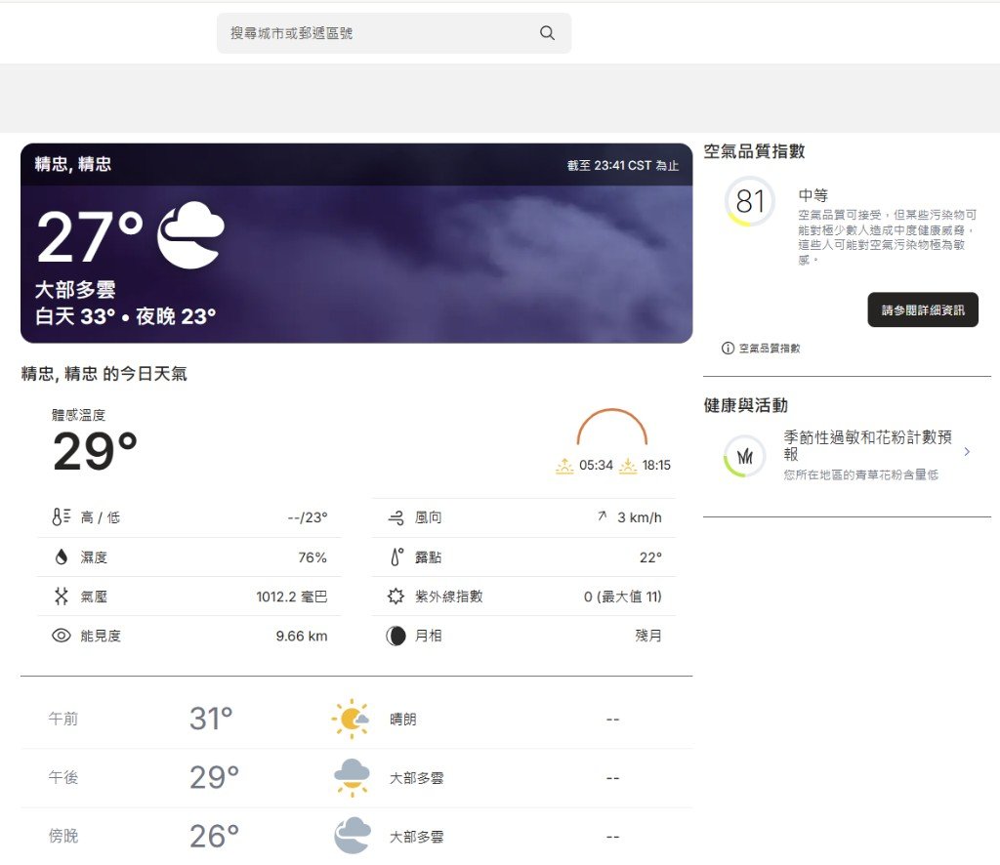
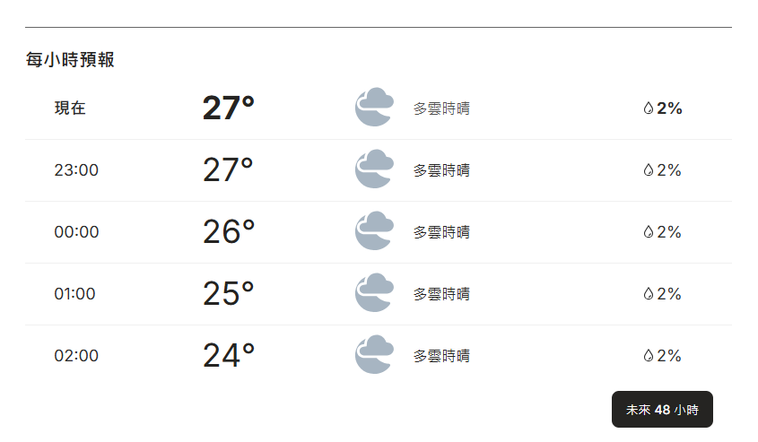
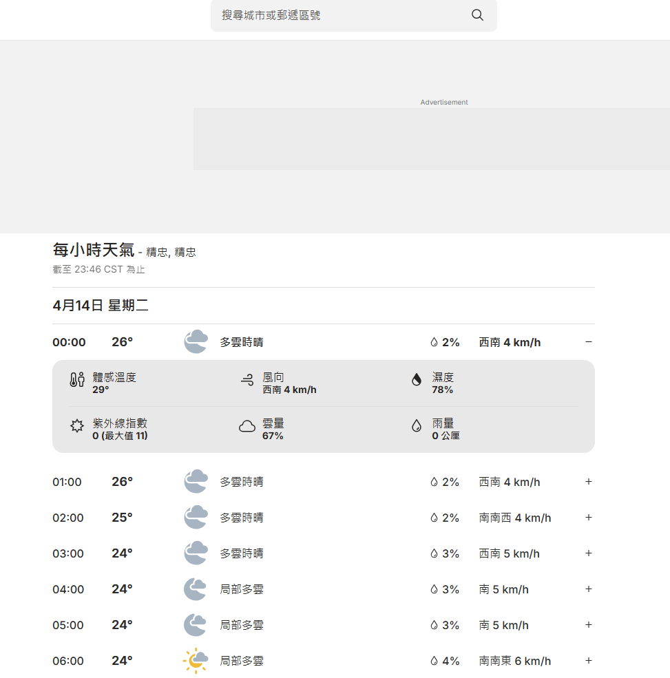
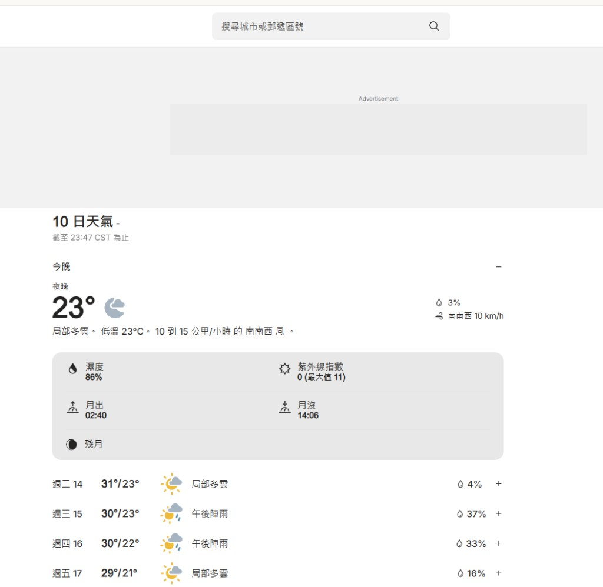
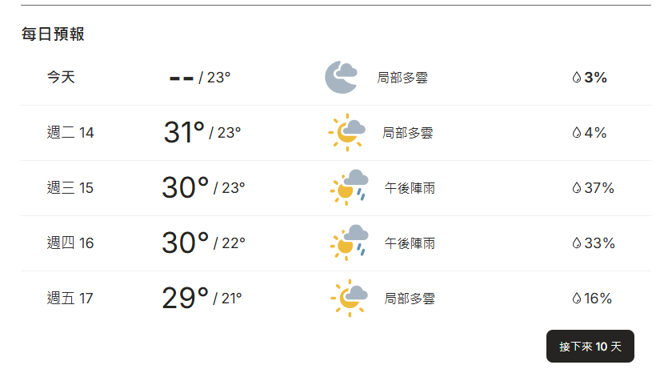
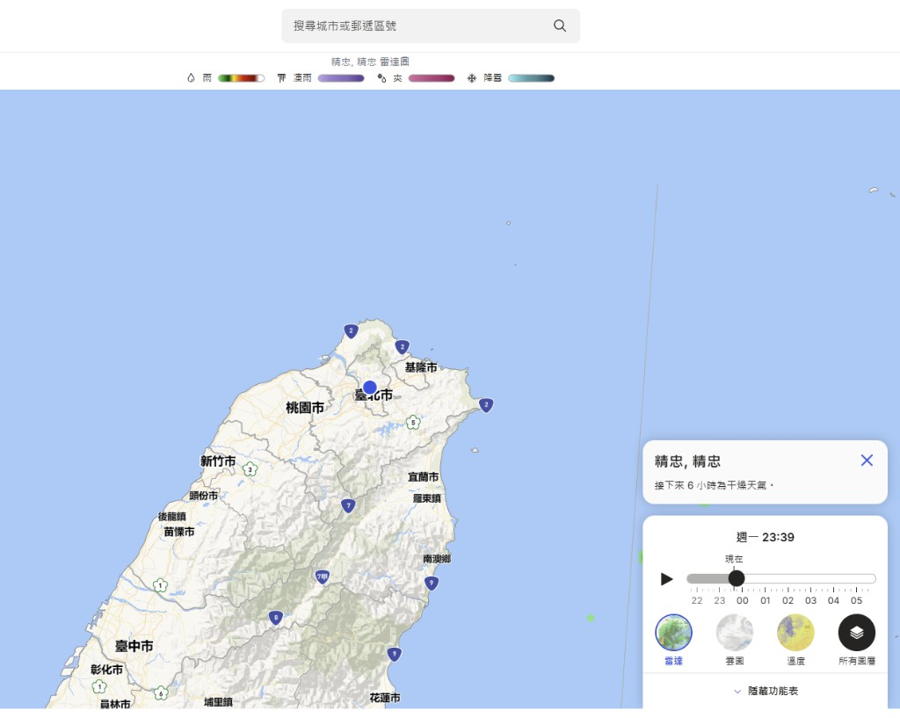

## App 元信息

| 字段         | 值                                                                 |
|--------------|-------------------------------------------------------------------|
| app_name     | weather-app                                                       |
| display_name | weather                                                           |
| domain       | Deep Research & Reporting                                         |
| description  | 在首页提供当天或次日基础天气概览，供 omni-morning-decision-brief 与综合 morning/decision brief 使用。 |
| web_url      | https://weather-app.local                                         |

## 锚点 App

| 字段     | 值                                                                                                                                 |
|----------|-----------------------------------------------------------------------------------------------------------------------------------|
| 名称     | Weather.com                                                                                                                        |
| URL      | https://www.weather.com                                                                                                            |
| 仿制范围 | 仿制：首页/当前位置区域中可一屏扫读的天气摘要、温度区间（或高低温）、降雨或天气状态展示、日期或「今天」类标识，以及「首页即可读完、少跳转」的信息布局思路。不仿制：广告与赞助位、雷达/地图全屏体验、视频与资讯流、账户登录与订阅、多城市管理、分钟级降水与告警推送等商业化或运营能力。 |

## Feature List

### 天气概览域

- **查看今日天气概览**：用户在首页直接读取今日天气 summary、温度区间、降雨/天气状态与日期标识，无需复杂跳转即可完成阅读。
  
  
  

- **查看次日天气概览**：用户读取未来一天的基础天气信息，作为当日简报与出行判断的补充上下文。
  
  

### 环境与健康域

- **支撑简报与风险提示**：weather-app 提供的当日与次日基础天气数据供综合 morning brief、decision brief 及 omni-morning-decision-brief 消费，用于补充出行风险、行程安排建议与健康相关提醒，并将天气纳入今日安排与风险提示。
  
  

## Data Schema

### 天气概览域

#### 表：`location`

> 用户当前查看天气的地点（mock 可预置 1～N 条，搜索仅匹配本地库）。

| 字段名 | 类型 | 必填 | 默认值 | 说明 |
|--------|------|------|--------|------|
| id | 整数 | 是 | 自增主键 | 唯一标识 |
| slug | 文本 | 是 | - | URL 或内部键，如 `jingzhong` |
| display_name | 文本 | 是 | - | 展示用地名 |
| timezone_label | 文本 | 否 | - | 如 `CST`，用于「截至 xx:xx」类文案 |

#### 表：`weather_daily`

> 按「天」粒度的预报，对应每日预报行与今日大卡中的高低温、状况、降水概率。

| 字段名 | 类型 | 必填 | 默认值 | 说明 |
|--------|------|------|--------|------|
| id | 整数 | 是 | 自增主键 | 唯一标识 |
| location_id | 整数 | 是 | - | 外键 → `location.id` |
| forecast_date | 日期时间 | 是 | - | 当地日历日，格式 `YYYY-MM-DD` |
| day_label | 文本 | 是 | - | 展示用，如 `今天`、`週二 14` |
| temp_high_c | 整数 | 否 | - | 摄氏高温，可为空（如「今天」仅低温） |
| temp_low_c | 整数 | 是 | - | 摄氏低温 |
| condition_text | 文本 | 是 | - | 如 `局部多雲`、`午後陣雨` |
| precip_probability | 整数 | 否 | 0 | 0–100，百分比 |
| wind_summary | 文本 | 否 | - | 可选，如风速风向摘要 |

#### 表：`weather_hourly`

> 每小时一行，支撑「每小時預報」列表与展开区指标。

| 字段名 | 类型 | 必填 | 默认值 | 说明 |
|--------|------|------|--------|------|
| id | 整数 | 是 | 自增主键 | 唯一标识 |
| location_id | 整数 | 是 | - | 外键 → `location.id` |
| hour_start | 日期时间 | 是 | - | `YYYY-MM-DD HH:MM:SS`，当地时刻 |
| temp_c | 整数 | 是 | - | 该小时气温 |
| condition_text | 文本 | 是 | - | 如 `多雲時晴` |
| precip_probability | 整数 | 否 | 0 | 0–100 |
| wind_dir_text | 文本 | 否 | - | 如 `西南` |
| wind_speed_kmh | 整数 | 否 | - | km/h |
| feels_like_c | 整数 | 否 | - | 展开区体感温度 |
| humidity_pct | 整数 | 否 | - | 0–100 |
| uv_index | 整数 | 否 | - | 0–11 等 |
| cloud_cover_pct | 整数 | 否 | - | 0–100 |
| rain_mm | 小数 | 否 | 0 | 该小时雨量（公厘） |

### 环境与健康域

#### 表：`air_quality_snapshot`

> 供简报侧栏与健康风险提示使用的空品快照（mock 存库，非外网实时）。

| 字段名 | 类型 | 必填 | 默认值 | 说明 |
|--------|------|------|--------|------|
| id | 整数 | 是 | 自增主键 | 唯一标识 |
| location_id | 整数 | 是 | - | 外键 → `location.id` |
| observed_at | 日期时间 | 是 | - | `YYYY-MM-DD HH:MM:SS` |
| aqi | 整数 | 是 | - | 指数值 |
| category | 枚举 | 是 | - | 完整可选值：`good`、`moderate`、`unhealthy_sensitive`、`unhealthy`、`hazardous`；mock 种子可仅用子集 |
| summary_text | 文本 | 否 | - | 对健康人群的简短说明 |

#### 表：`health_activity_tip`

> 锚点中的「健康與活動」一行文案（如花粉），供 decision brief 引用。

| 字段名 | 类型 | 必填 | 默认值 | 说明 |
|--------|------|------|--------|------|
| id | 整数 | 是 | 自增主键 | 唯一标识 |
| location_id | 整数 | 是 | - | 外键 → `location.id` |
| valid_date | 日期时间 | 是 | - | 当地日 `YYYY-MM-DD` |
| tip_title | 文本 | 否 | - | 区块标题 |
| tip_body | 文本 | 是 | - | 如花粉含量描述 |

**表间关系**：

| 关系 | 类型 | 级联行为 |
|------|------|----------|
| `weather_daily.location_id` → `location.id` | 多对一 | 删除地点时删除其日预报 |
| `weather_hourly.location_id` → `location.id` | 多对一 | 删除地点时删除其小时数据 |
| `air_quality_snapshot.location_id` → `location.id` | 多对一 | 删除地点时删除其空品快照 |
| `health_activity_tip.location_id` → `location.id` | 多对一 | 删除地点时删除其健康提示 |
